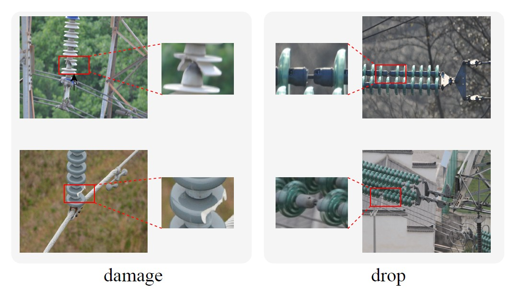
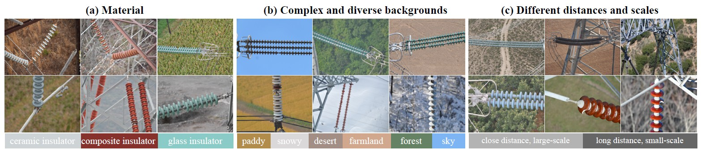
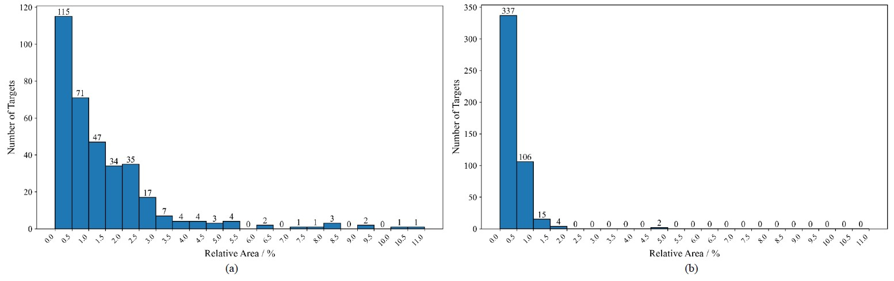
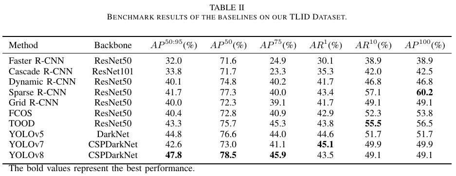
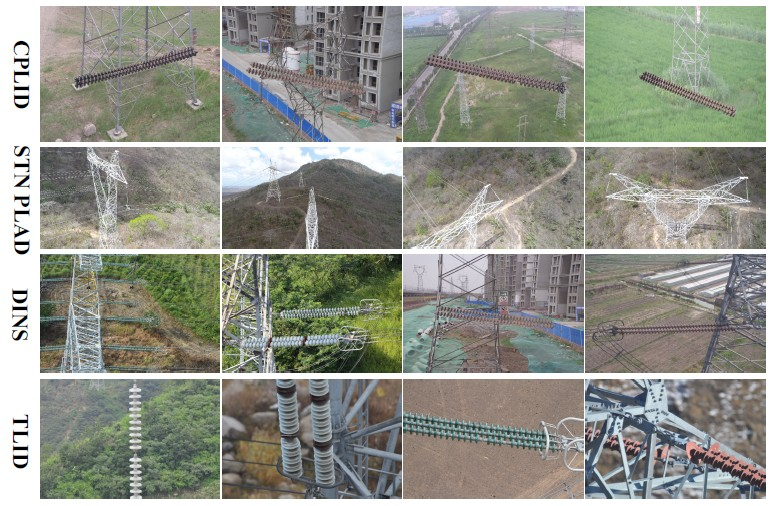
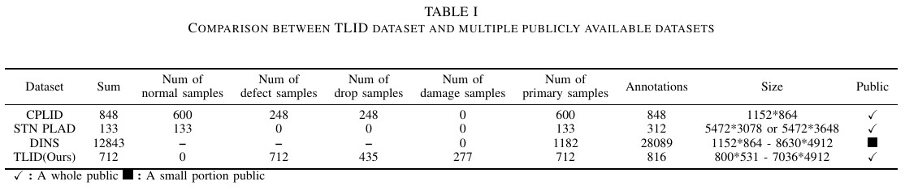

# TLID-Transmission Line Insulation Defect Dataset

**Towards Defect Detection of Transmission Line Insulator.**

The TLID dataset is a publicly available dataset released by the Power Vision Research Center of the School of Artificial Intelligence at North China Electric Power University （NCEPU）. This dataset includes detailed images of insulator defect samples from multiple backgrounds and materials. We hope that these works can assist researchers engaged in this field.

we introduce the Transmission Line Insulation Defect (TLID) dataset, designed for practical insulator defect detection. TLID contains 712 images with 816 annotated bounding boxes, covering three insulator materials (ceramic, composite, glass), seven background scenarios (e.g., fields, snow, desert), and two viewpoints (close-range with large-scale features and long-distance with small-scale features). We benchmark state-of-the-art object detection algorithms on TLID and analyze their performance.

### **1. Insulator structural defect images captured by UAVs**

Fig.1 The insulator defects (damage and drop) under complex environmental pose hidden risks to the stable operation of transmission lines.

### **2. The Detailed Composition of TLID Dataset**

Fig.2 The detailed composition of TLID dataset. The TLID dataset is meticulously designed, encompassing several key aspects: (a) diverse materials, (b) complex and diverse backgrounds and (c) different distances and scales.

Fig.3 Scale distribution of defect samples in the TLID dataset. (a) The scale distribution of damage samples. (b) The scale distribution of drop samples.

### **3. Benchmark Results on The TLID Dataset**

### **4. Comparison with Other Datasets**

Fig.4 Comparison of Insulator and Defect Images from Various Datasets: The defect images in the CPLID dataset are artificially synthesized (1st row). The STN PLAD dataset images lack defective samples and feature a uniform background (2nd row). The DINS dataset consists of defect images from other publicly available datasets, as well as additional artificially synthesized defects (3rd row). In contrast, the dataset we propose is comprised of samples collected from multiple real-world environments (4th row).

### **5. Challenges and Open Issues**

**(1) The Impact of Imbalance Class Distribution.**

Insulator defects in transmission lines occur randomly and unevenly. TLID dataset shows class imbalance by reflecting the true ratio of drop defects to damage defects.

**(2) The Feature Extraction of Hard Defect Samples.**

The damage defect in transmission line insulators exhibit complex and diverse features under natural conditions. Even within the same class, varying damage levels lead to significant differences in the distribution of deep feature space.

**(3) The Interference of Complex Background.** 

In complex backgrounds such as forests, farmlands, or cities, existing models struggle to extract clear foreground features, especially when defect regions closely resemble the background in color and texture, making insulator defect detection highly challenging.

### 6. Download

If you wish to utilize the TLID dataset for research in power vision, please contact me via email. In your request, kindly indicate your full name and affiliated institution. Upon receipt and verification of your application, I will provide you with a reply containing the official download link for the TLID dataset.

My E-mail:

caughyhzd@foxmail.com

